---
title: MOUNTAIN TRIPS PAGE
layout: template
filename: munte.md
--- 

# Excursii la munte Olga

<!-- TOC -->
* [Excursii la munte Olga](#excursii-la-munte-olga)
  * [2022 Apr 25 - Tara Luanei, Poiana Cozanei](#2022-apr-25---tara-luanei-poiana-cozanei)
  * [2022 Aug 14 - Ochiul Beiului, Cheile Nerei](#2022-aug-14---ochiul-beiului-cheile-nerei)
  * [2022 Aug 16 - Dubova, Ciucarul Mare](#2022-aug-16---dubova-ciucarul-mare)
  * [2022 Oct 27 - Piatra Craiului, Curmatura Groapelor](#2022-oct-27---piatra-craiului-curmatura-groapelor)
  * [2023 Jan 21-22 - Baiului, Girbova](#2023-jan-21-22---baiului-girbova)
  * [2024 Feb 17-18 - Baiului, Girbova](#2024-feb-17-18---baiului-girbova)
  * [2024 Aug 1 - Negoiu, Serbota](#2024-aug-1---negoiu-serbota)
  * [2024 Aug 2, Negoiu, Saratii](#2024-aug-2-negoiu-saratii)
  * [2024 Aug 19, Predelut, Magura Mare](#2024-aug-19-predelut-magura-mare)
  * [2024 Sep 7, Bucegi, Strunga - Batrana - Doamnele](#2024-sep-7-bucegi-strunga---batrana---doamnele)
  * [2024 Oct 13 - Fagarasi, Capra - Ferestra Zmeilor](#2024-oct-13---fagarasi-capra---ferestra-zmeilor)
  * [2024 Oct 27 - Cindrel, Valea Frumoasei](#2024-oct-27---cindrel-valea-frumoasei)
  * [2024 Oct 28 - Voineasa, Dalmele](#2024-oct-28---voineasa-dalmele)
  * [2025 Feb 15-16 - Baiului, Clabucetul Taurului](#2025-feb-15-16---baiului-clabucetul-taurului)
  * [2025 Feb 18 - Bucegi, Diham - Pichetul Rosu](#2025-feb-18---bucegi-diham---pichetul-rosu)
  * [2025 May 2 - Poiana Viselor, Poiana Marului](#2025-may-2---poiana-viselor-poiana-marului)
  * [2025 May 3 - La Stejar, Poiana Marului - Fereastra Holbavului](#2025-may-3---la-stejar-poiana-marului---fereastra-holbavului)
<!-- TOC -->

## 2022 Apr 25 - Tara Luanei, Poiana Cozanei

> Nucu - Poiana Cozanei - Nucu

[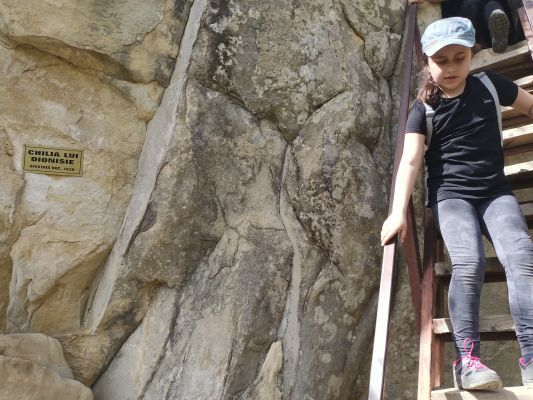](./2022_04_25_p1.jpg)
[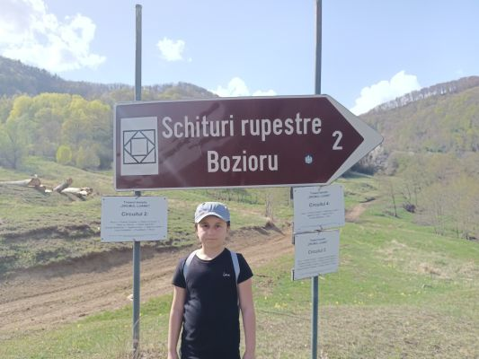](./2022_04_25_p2.jpg)

## 2022 Aug 14 - Ochiul Beiului, Cheile Nerei

> Sasca Montana - Ochiul Beiului - Sasca Montana

[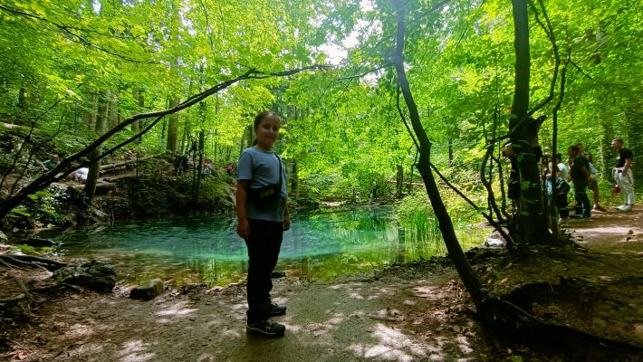](./2022_08_16_p2.jpg)

## 2022 Aug 16 - Dubova, Ciucarul Mare

> DN57 - Ciucarul Mare - DN57

Atentie la vipere!

[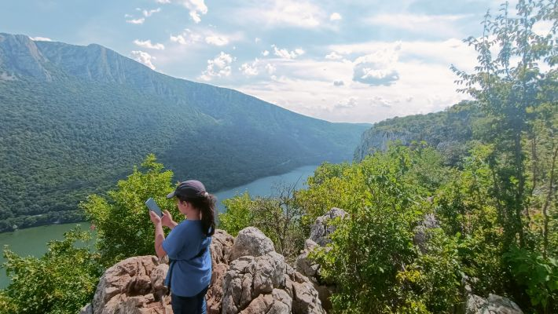](./2022_08_16_p1.jpg)

## 2022 Oct 27 - Piatra Craiului, Curmatura Groapelor

> Sirnea - Curmatura Groapelor - Sirnea

Aici exista locuri foarte bune pe care sa faci roata!

[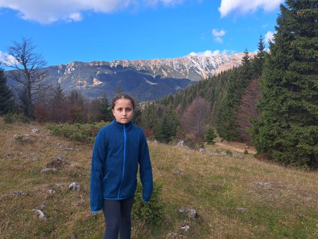](./2022_10_27_p1.jpg)
[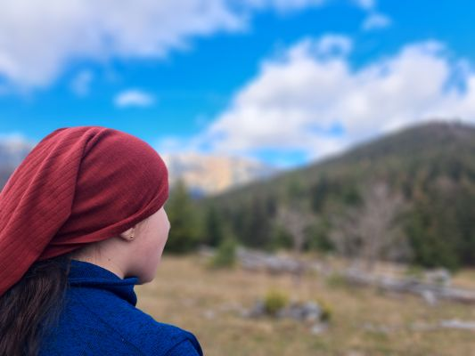](./2022_10_27_p2.jpg)

## 2023 Jan 21-22 - Baiului, Girbova

> Clabucet Plecare - Cabana Girbova - Clabucetul Taurului - si retur

Este zapada foarte buna pentru oameni de zapada si dat pe sanie aici!

[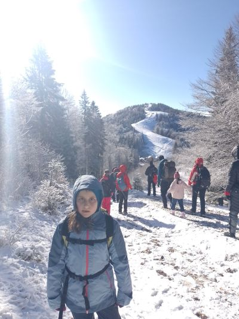](./2023_01_21_p1.jpg)
[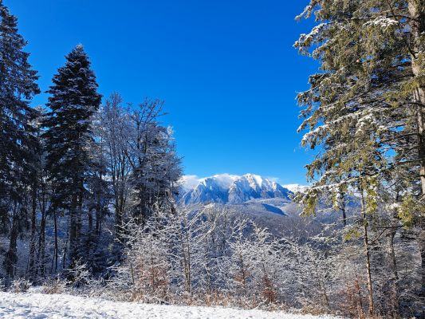](./2023_01_22_p1.jpg)

## 2024 Feb 17-18 - Baiului, Girbova

> Clabucet Plecare - Cabana Girbova - Clabucetul Taurului - si retur

La fel ca anul trecut!

[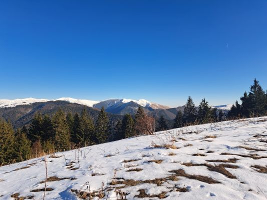](./2024_02_19_p1.jpg)
[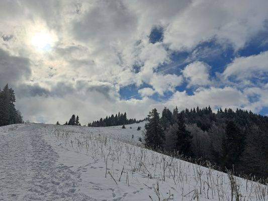](./2024_02_19_p2.jpg)

## 2024 Aug 1 - Negoiu, Serbota

> Cabana Negoiu - Varful Serbota - Cabana Negoiu (dunga albastra)

De la cabana Negoiu, pe poteca dunga albastra, in sus pe muchia Serbotei pana pe varful Serbota si inapoi pe acelasi traseu.

[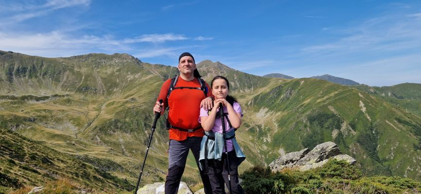](./2024_08_01_p1.jpg)
[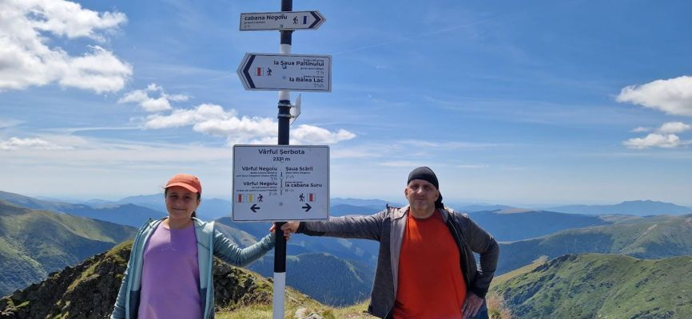](./2024_08_01_p2.jpg)

## 2024 Aug 2, Negoiu, Saratii

> Cabana Negoiu - Cascada Saratii - Cabana Negoiu (triunghi albastru)

De la cabana Negoiu, pe poteca triunghi albastru, pe Podetele Zmeilor, se ajunge in Valea Saratii.

[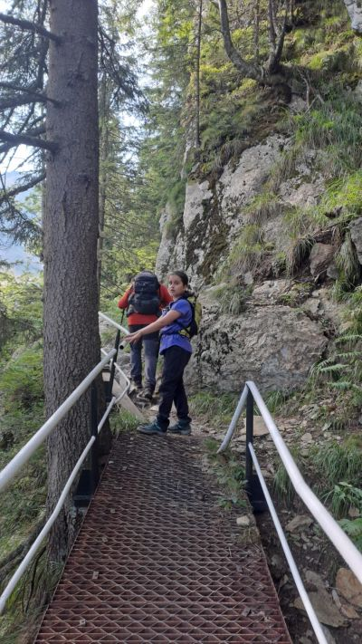](./2024_08_02_p1.jpg)

Iesind din padure, intalnim zona de jnepenis si apoi pajiste alpina, cum intram in vale. In vale se ajunge la cascada Saratii care cade de mai sus printre stanci.

[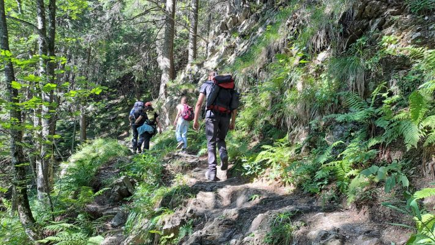](./2024_08_02_p2.jpg)

De aici, se trece raul si se poate continua urcusul spre Piatra Pranzului si apoi ori spre lacul Caltun prin Strunga Ciobanului, ori spre varful Negoiu prin saua Cleopatrei.

## 2024 Aug 19, Predelut, Magura Mare

> Magura - Varful Galbinarea - Magura Mare - Bran

E foarte frumos aici!

## 2024 Sep 7, Bucegi, Strunga - Batrana - Doamnele

> Cabana Padina - refugiul Saua Strunga - refugiul Saua Batrana - cascada Doamnele - hotel Pestera

De la cabana Padina se urca direct spre saua Strunga.

De la refugiu din sa, se urca in dreapta pe creasta si apoi se merge de-a lungul crestei Batrana. 

De la refugiul Batrana incepe coborarea spre cascada Doamnele prin valea Doamnele.

In dreptul cascadei, coborarea lina e intrerupta de o rupere de panta unde se descatara pe bolovanis. 

Jos, dupa cascada sunt de obicei stane cu vaci, cai, etc.

[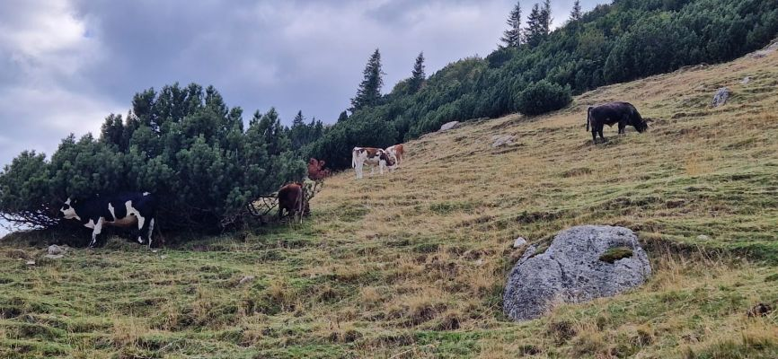](./2024_09_07_p7.jpg)

## 2024 Oct 13 - Fagarasi, Capra - Ferestra Zmeilor

> Transfagarasan - lacul Capra - Fereastra Zmeilor

Aproximativ 4 ore si jumatate de la asfalt la asfalt.

Am intrat din Transfagarasan de la ultima serpentina inainte de centrul Salvamont de pe partea sudica.

Apoi am ajuns la lacul Capra

Am iesit inapoi la asfalt de pe drumul forestier care urca la stana de sub Fereastra Zmeilor (cam 3 km mai jos pe Transfagarasan decat punctul de pornire).

## 2024 Oct 27 - Cindrel, Valea Frumoasei

> Valea Frumoasei - [Varful Cindrel (2245)](https://ro.wikipedia.org/wiki/Vârful_Cindrel,_Munții_Cindrel) - Iezerul Mare - Iezerul Mic - Valea Frumoasei

Aproximativ 4 ore si jumatate.

[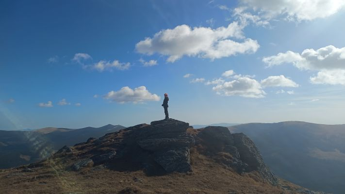](./2024_10_27_p2.jpg)

## 2024 Oct 28 - Voineasa, Dalmele

> Voinesita - Varful Dalmele - si retur

Aproximativ 4 ore dus-intors.  
Era forte cald!

## 2025 Feb 15-16 - Baiului, Clabucetul Taurului

> Clabucet Plecare - Cabana Girbova - Clabucetul Taurului - si retur

La cabana Girbova si apoi in apropiere de Clabucetul Taurului.  
Anul acesta nu e la fel de buna zapada pentru oameni de zapada, este pulver.

[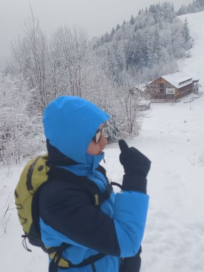](./2025_02_16_p1.jpg)

## 2025 Feb 18 - Bucegi, Diham - Pichetul Rosu

> Cabana Gura Diham - Cabana Saua Diham - Cabana Diham - Pichetul Rosu - Cabana Poiana Izvoarelor - Cabana Gura Diham

Intre Saua Diham si cabana Diham si apoi la Pichetul Rosu.

## 2025 May 2 - Poiana Viselor, Poiana Marului

> Apple Glade - [Poiana Viselor](https://maps.app.goo.gl/UhK6dYnHJE3Fg8Hb7)

## 2025 May 3 - La Stejar, Poiana Marului - Fereastra Holbavului

> Apple Glade - [La Stejar](https://maps.app.goo.gl/mNpfFRsHbYqR3R9k6) - [Fereastra Holbavului](https://maps.app.goo.gl/yhjMr4d1NrLqiADG7)

